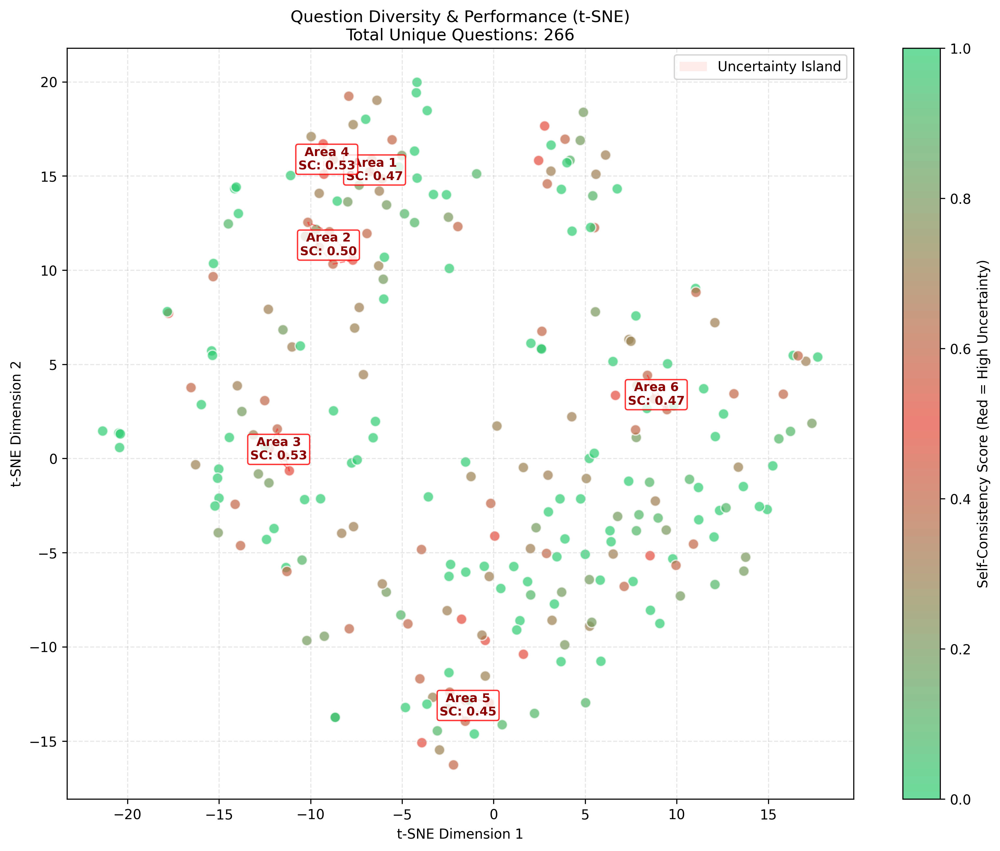

# Curriculum0 Agent

This project is build on top of [VeRL 0.7.0](https://github.com/verl-project/verl)

The uncertainity areas of the math questions generated by Curricum0-Qwen3-4B are shown in the figure below.



## Machine#1 (2xCPU with SandboxFusion)

### Install depency and start service
```bash
cd /workspace/curriculum0
git pull
pip install -r math_agent/requirements.txt
bash scripts/start_math_agent.sh
python math_agent/test_service.py
python math_agent/test_service_parallel.py
```

## Machine#2 (2xA40)

### Runpod configuration
```bash
cd /workspace/curriculum0
git pull
bash scripts/ssh-config.sh
```

### Install Dependencies
```bash
bash scripts/verl-install.sh
pip install -r requirements.txt
# (Optional) to check
pip install nvitop

bash scripts/install_metrics.sh
```

### Start Distripution Service
```bash
# replace to the CPU machine's TPC 8000 part mapping
export MATH_AGENT_URL=tcp://213.173.105.83:11491
bash scripts/start_disptacher.sh
```

### Start Ray and Metrics
```bash
bash scripts/start_ray_master.sh
```

### Start Testing
```bash
# clean up previous data in case you want to start from begining
rm -rf questions
rm -rf metrics
rm -rf checkpoints/curriculum_agent

# Start training in background with logging
bash scripts/train_4b_lora.sh
```